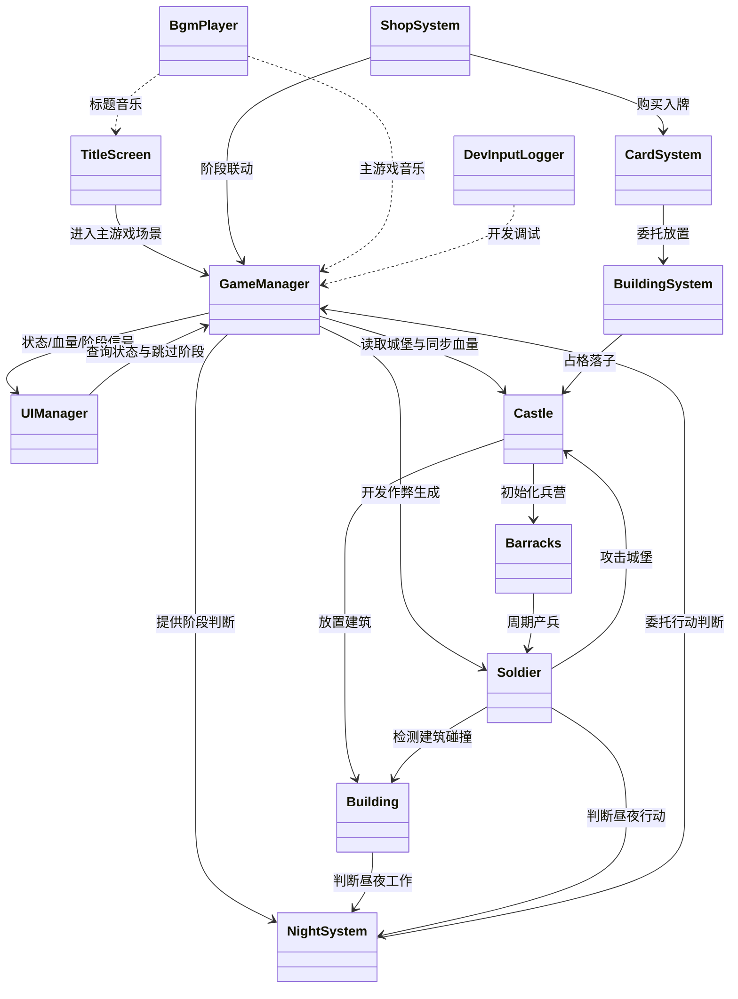
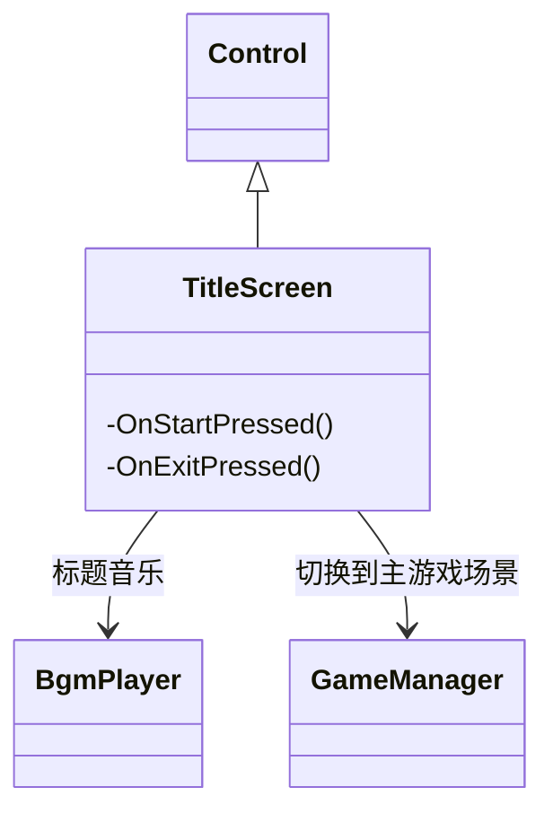
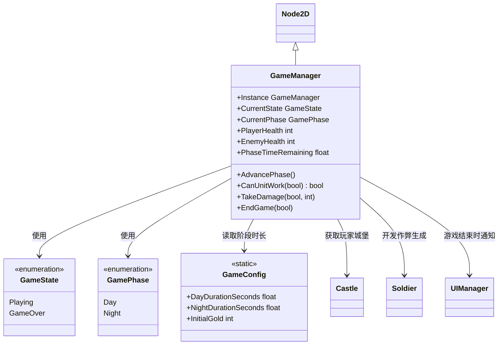
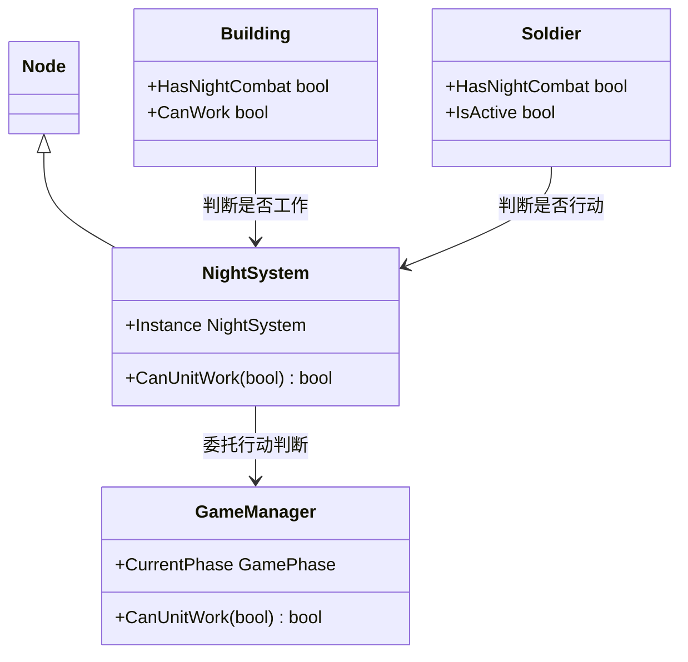
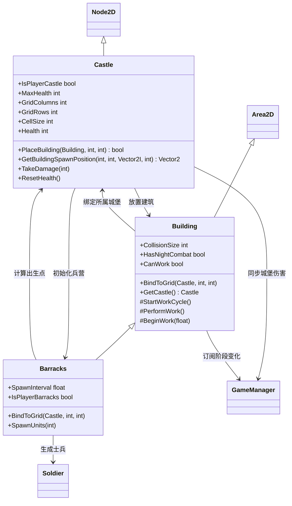
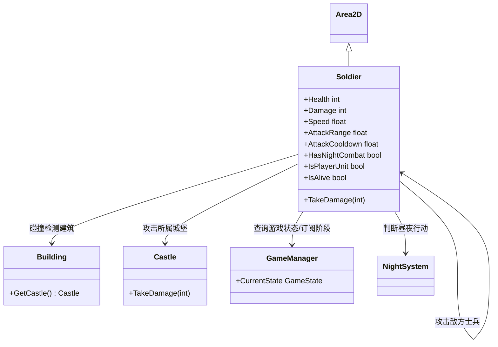
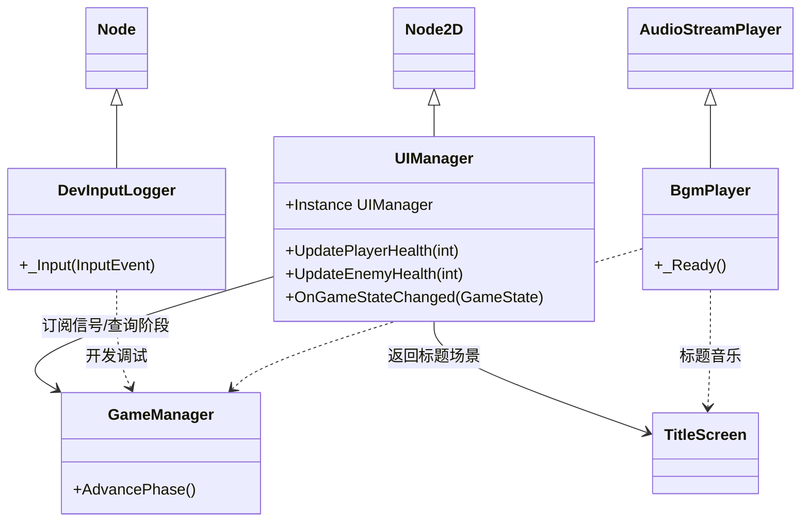
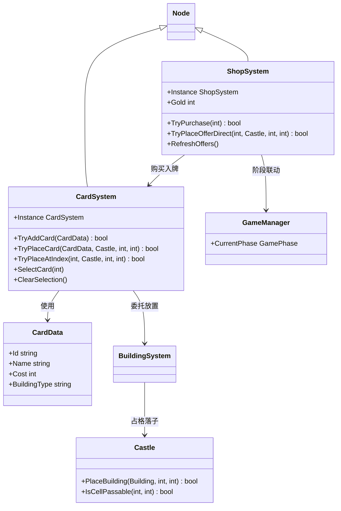

# 代码结构文档 — CasualCastle

本文档记录当前代码中已经存在的系统、类和结构关系。概念定义以 `devPlan/concepts.md` 为准；这里侧重运行时代码事实。

---

## 项目结构概览

CasualCastle 是 Godot 4.6 C# 项目，主入口配置在 `project.godot`：

- 启动场景：`scenes/ui/title_screen.tscn`
- 主游戏场景：`scenes/main/main_game.tscn`
- C# 脚本根目录：`scripts/`
- 可复用预制体：`prefabs/`

当前 `scripts/` 按业务模块划分：

| 模块目录 | 业务模块 | 主要文件 |
| --- | --- | --- |
| `autoload/` | GameManager | `GameManager.cs` |
| `core/` | DataResources | `GameConfig.cs` |
| `flow/` | SceneFlow | `TitleScreen.cs`, `MainGameController.cs` |
| `ui/` | UIManager | `UIManager.cs` 及 UI 子控制器 |
| `shop/` | ShopSystem | `ShopSystem.cs` |
| `card/` | CardSystem | `CardSystem.cs`, `CardData.cs` |
| `night/` | NightSystem | `NightSystem.cs` |
| `building/` | BuildingSystem | `Castle.cs`, `Building.cs`, `Barracks.cs`, `ArcheryRange.cs`, `Stable.cs`, `BuildingSystem.cs`, `AdjacentSystem.cs` |
| `battle/` | BattleSystem | `Soldier.cs` |
| `audio/` | 音频 | `BgmPlayer.cs` |
| `dev/` | 开发辅助 | `DevInputLogger.cs` |

当前 `main_game.tscn` 的核心节点结构：

- `MainGame`
- `DevInputLogger`
- `BGM`
- `UIManager`
- `NightSystem`
- `ShopSystem`
- `CardSystem`
- `BuildingSystem`
- `AdjacentSystem`
- `Battlefield`
  - `PlayerSide/PlayerCastle`
  - `EnemySide/EnemyCastle`
- `UI`

---

## 系统划分与现有类

### 启动与场景切换系统

负责标题界面、进入主游戏、退出游戏。

| 类 | 文件 | Godot 基类 | 职责 |
| --- | --- | --- | --- |
| `TitleScreen` | `scripts/flow/TitleScreen.cs` | `Control` | 绑定标题界面按钮，开始游戏时切换到 `main_game.tscn`，退出时关闭游戏。 |

结构关系：

- `project.godot` 将 `title_screen.tscn` 配置为启动场景。
- `title_screen.tscn` 挂载 `TitleScreen`，同时复用 `BgmPlayer` 播放标题音乐。
- `TitleScreen` 通过 `GetTree().ChangeSceneToFile()` 进入主游戏。

### 全局游戏状态系统

负责游戏胜负、双方城堡生命值、昼夜阶段和开发作弊出兵。

| 类 | 文件 | Godot 基类 | 职责 |
| --- | --- | --- | --- |
| `GameManager` | `scripts/autoload/GameManager.cs` | `Node2D` | Godot Autoload；维护 `GameState`、`GamePhase`、双方血量、阶段计时；发出血量/状态/阶段信号；处理 P 键开发出兵。 |
| `MainGameController` | `scripts/flow/MainGameController.cs` | `Node2D` | 主游戏场景控制器；进入场景时把 `Battlefield` 和玩家 `Castle` 注册给 `GameManager`，离开场景时清理本局引用。 |
| `GameManager.GameState` | `scripts/autoload/GameManager.cs` | `enum` | 当前游戏状态：`Playing` / `GameOver`。 |
| `GameManager.GamePhase` | `scripts/autoload/GameManager.cs` | `enum` | 当前昼夜阶段：`Day` / `Night`。 |

结构关系：

- `GameManager.Instance` 是 Godot Autoload 单例入口。
- `MainGameController` 在主游戏场景进入树时调用 `GameManager.StartGameSession()` 注册 `Battlefield` 和玩家 `Castle`。
- `Castle.TakeDamage()` 会调用 `GameManager.TakeDamage()` 同步顶部 UI 血量与胜负。
- `UIManager`、`Building`、`Soldier` 订阅或查询 `GameManager` 的状态与阶段。
- `NightSystem` 最终委托 `GameManager.CanUnitWork()` 判断单位是否可行动。

### 昼夜系统

负责给建筑和士兵提供昼夜行动判断入口。

| 类 | 文件 | Godot 基类 | 职责 |
| --- | --- | --- | --- |
| `NightSystem` | `scripts/night/NightSystem.cs` | `Node` | 提供 `CanUnitWork()` 静态方法，根据 `GameManager` 当前阶段判断单位/建筑是否可工作。 |
| `GameConfig` | `scripts/core/GameConfig.cs` | `static class` | 保存昼夜时长和初始金币等全局配置常量。 |

结构关系：

- `GameManager.BeginPhase()` 使用 `GameConfig.DayDurationSeconds` / `NightDurationSeconds` 设置阶段时长。
- `Building.CanWork` 和 `Soldier.IsActive` 都通过 `NightSystem.CanUnitWork(HasNightCombat)` 判断是否休眠。
- 当前 `NightSystem` 只作为统一入口，没有批量管理场上单位列表。

### 城堡与建筑系统

负责城堡网格、建筑放置、兵营工作循环和产兵。

| 类 | 文件 | Godot 基类 | 职责 |
| --- | --- | --- | --- |
| `Castle` | `scripts/building/Castle.cs` | `Node2D` | 城堡网格、占格、血条、放置预览绘制、初始兵营。 |
| `Building` | `scripts/building/Building.cs` | `Area2D` | 建筑基类；main 格、工作循环、工作速度倍率（邻接加成）。 |
| `Barracks` | `scripts/building/Barracks.cs` | `Building` | 兵营；周期产兵。 |
| `ArcheryRange` | `scripts/building/ArcheryRange.cs` | `Building` | 靶场（2 格）；产远程士兵。 |
| `Stable` | `scripts/building/Stable.cs` | `Building` | 马厩（L 形 4 格）；产快速士兵。 |
| `BuildingSystem` | `scripts/building/BuildingSystem.cs` | `Node` | 统一放置入口；占地与 main 格配置表。 |
| `AdjacentSystem` | `scripts/building/AdjacentSystem.cs` | `Node` | 邻接检测、兵营加速、放置光圈触发。 |
| `AdjacentLinkPulse` | `scripts/building/AdjacentLinkPulse.cs` | `Node2D` | 邻接反馈 shader 光圈（挂在 main 格）。 |

结构关系：

- `Castle` 在 `_Ready()` 中调用 `SetupBarracks()`，实例化 `prefabs/Barracks.tscn`。
- `Barracks` 继承 `Building`，调用 `BindToGrid()` 绑定所属 `Castle` 和地块坐标。
- `Castle.PlaceBuilding()` 将建筑放入地块中心并记录占用。
- `Building` 订阅 `GameManager.PhaseChanged`，昼夜变化时暂停或恢复工作循环。
- `Barracks.PerformWork()` 实例化 `prefabs/Soldier.tscn`，将 `Soldier` 加入 `Battlefield`。

### 士兵与战斗系统

负责士兵推进、索敌、攻击敌方士兵和攻打敌方城堡。

| 类 | 文件 | Godot 基类 | 职责 |
| --- | --- | --- | --- |
| `Soldier` | `scripts/battle/Soldier.cs` | `Area2D` | 基础战斗单位；按阵营推进，检测敌方士兵/建筑，攻击目标并处理死亡。 |

结构关系：

- `Barracks` 和 `GameManager` 都可以实例化 `Soldier`。
- `Soldier.IsPlayerUnit` 决定移动方向和敌我关系。
- `Soldier` 通过 `AreaEntered` / `AreaExited` 检测敌方 `Soldier` 和 `Building`。
- 当 `Soldier` 进入敌方 `Building` 碰撞区时，通过 `Building.GetCastle()` 获取目标 `Castle` 并调用 `Castle.TakeDamage()`。
- `Soldier` 订阅 `GameManager.PhaseChanged`，夜晚休眠时停止移动和攻击。

### UI、音频与开发辅助系统

负责主游戏 UI、背景音乐和开发输入日志。

| 类 | 文件 | Godot 基类 | 职责 |
| --- | --- | --- | --- |
| `UIManager` | `scripts/ui/UIManager.cs` | `Node2D` | 主游戏 UI 入口；组合 HUD、商店、手牌和结算 UI 控制器，并转发输入与游戏状态变化。 |
| `HudUiController` | `scripts/ui/HudUiController.cs` | 普通 C# 类 | 更新顶部血条、金币、昼夜显示、阶段倒计时，并处理跳过阶段按钮。 |
| `ShopUiController` | `scripts/ui/ShopUiController.cs` | 普通 C# 类 | 控制商店开关、商品显示、购买、刷新、拖拽商品直放与商店金币显示。 |
| `HandUiController` | `scripts/ui/HandUiController.cs` | 普通 C# 类 | 控制手牌显示、选中态、点击/拖拽放置、放置提示与预览。 |
| `GameOverUiController` | `scripts/ui/GameOverUiController.cs` | 普通 C# 类 | 控制游戏结束遮罩、胜负文字和返回标题按钮。 |
| `BgmPlayer` | `scripts/audio/BgmPlayer.cs` | `AudioStreamPlayer` | 加载并循环播放背景音乐。 |
| `DevInputLogger` | `scripts/dev/DevInputLogger.cs` | `Node` | 打印按键输入信息，用于开发调试。 |

结构关系：

- `UIManager` 从父节点获取 `CanvasLayer` 下的 UI 根节点，并创建各子 UI 控制器。
- `HudUiController` 订阅 `GameManager` 的血量和阶段信号，跳过阶段按钮调用 `GameManager.AdvancePhase()`。
- `ShopUiController` 订阅 `ShopSystem` 的金币、商品、可用性和打开请求信号；商品名支持拖拽直放到城堡。
- `HandUiController` 订阅 `CardSystem` 的手牌和选中信号；支持点击选中后点击城堡放置，或拖拽手牌到城堡放置。
- `GameOverUiController` 的返回标题按钮切回 `title_screen.tscn`。
- `BgmPlayer` 同时用于标题场景和主游戏场景。

### 商店与手牌系统

负责金币消费、商品刷新、手牌管理与建筑卡放置。

| 类 | 文件 | Godot 基类 | 职责 |
| --- | --- | --- | --- |
| `ShopSystem` | `scripts/shop/ShopSystem.cs` | `Node` | 维护金币、商品槽、刷新与购买；支持 `TryPlaceOfferDirect` 拖拽直放。 |
| `CardSystem` | `scripts/card/CardSystem.cs` | `Node` | 维护手牌、选中态；`TryPlaceCard` / `TryPlaceAtIndex` 放置建筑并更新手牌。 |
| `CardData` | `scripts/card/CardData.cs` | `class` | 卡牌运行时数据（Id、Name、Cost、BuildingType）。 |

结构关系：

- `ShopSystem` 订阅 `GameManager` 阶段与状态，夜晚自动请求打开商店。
- `ShopSystem.TryPurchase` 扣费后将卡牌加入 `CardSystem` 手牌。
- `CardSystem.TryPlaceCard` 委托 `BuildingSystem.TryPlace`。
- `BuildingSystem.TryPlace` 成功后由 `AdjacentSystem.OnBuildingPlaced` 刷新加成并播放邻接光圈。
- `UIManager` 转发 Esc、鼠标输入，协调商店拖拽与手牌拖拽的优先级。

### 待扩展系统

| 类 | 文件 | 当前状态 |
| --- | --- | --- |
| `BuildingData` .tres | 待建 | 建筑数据仍硬编码在 `BuildingSystem` 配置表 |
| 建筑信息面板 UI | 待建 | M3 收尾 |

---

## 类图

### 总览类图

总览类图只展示系统级关系，具体字段、方法和继承关系放在后面的分系统类图中。

### 启动与场景切换系统类图

### 全局游戏状态系统类图

### 昼夜系统类图

### 城堡与建筑系统类图

### 士兵与战斗系统类图

### UI、音频与开发辅助系统类图

### 商店与手牌系统类图

---

## 当前主要运行链路

1. `project.godot` 启动 `title_screen.tscn`。
2. `TitleScreen` 点击开始后进入 `main_game.tscn`。
3. `GameManager` 作为 Godot Autoload 常驻；`main_game.tscn` 创建 `UIManager`、`NightSystem`、`ShopSystem`、`CardSystem`、`Battlefield` 和双方 `Castle`。
4. `MainGameController` 进入场景时调用 `GameManager.StartGameSession()` 开始本局。
5. 每个 `Castle` 初始化网格和血条，并创建一座 `Barracks`。
6. `Barracks` 绑定所属 `Castle` 后进入 `Building` 工作循环。
7. `GameManager` 维护昼夜倒计时，阶段变化时发出 `PhaseChanged`。
8. `Building` 和 `Soldier` 根据 `NightSystem.CanUnitWork()` 在夜晚休眠或继续行动。
9. `Barracks` 周期性生成 `Soldier`；`Soldier` 推进、索敌、攻击敌方士兵或敌方城堡。
10. `Castle.TakeDamage()` 同步到 `GameManager.TakeDamage()`；血量归零后进入 `GameOver`。
11. `UIManager` 根据 `GameManager` 信号刷新血条、阶段显示和游戏结束界面。
12. 玩家打开商店购买或拖拽商品直放；手牌点击或拖拽经 `BuildingSystem` 放置建筑。
13. `AdjacentSystem` 刷新邻接加成，并在邻接建筑 main 格播放光圈特效。

---

## 维护建议

- 新增建筑类型时，同步更新 `BuildingSystem` 配置表与 `devPlan` 文档。
- `GameManager` 是真正的 Godot Autoload；`UIManager` 仍是主游戏场景内 UI 控制节点。
