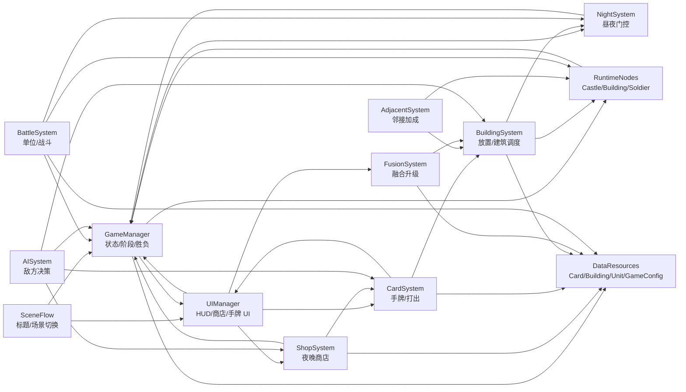

# 五、项目架构

## 5.1 实际目录结构（当前）

```
CasualCastle/
├── scripts/
│   ├── autoload/              # 场景内单例（未注册 Godot Autoload）
│   │   ├── GameManager.cs
│   │   └── UIManager.cs
│   ├── nodes/
│   │   ├── Building.cs        # 建筑基类
│   │   ├── Barracks.cs
│   │   ├── Soldier.cs
│   │   ├── Castle.cs
│   │   └── BgmPlayer.cs
│   ├── ui/
│   │   └── TitleScreen.cs
│   └── utils/
│       └── DevInputLogger.cs
├── scenes/
│   ├── main/main_game.tscn
│   └── ui/title_screen.tscn
├── prefabs/
│   ├── Castle.tscn
│   ├── Barracks.tscn
│   └── Soldier.tscn
├── assets/                    # 占位图、士兵图、BGM、卡牌边框
├── devPlan/                  # 开发文档
│   ├── outline/               # 开发大纲，按章节拆分
│   ├── concepts.md
│   ├── currentTasks.md
│   ├── codeStructure.md
│   └── dataStructures.md
└── resources/                 # 空，待放 .tres 数据资源
```

## 5.2 规划目录结构（完整版目标）

```
scripts/
├── autoload/
│   ├── GameManager.cs         # 扩展：阶段状态机
│   ├── CardSystem.cs          # 待建
│   └── UIManager.cs           # 扩展：商店/手牌 UI
├── systems/
│   ├── ShopSystem.cs          # 待建
│   ├── BuildingSystem.cs      # 待建
│   ├── AdjacentSystem.cs      # 待建
│   ├── FusionSystem.cs        # 待建
│   ├── BattleSystem.cs        # 待建（从 Soldier 逻辑抽离）
│   └── NightSystem.cs         # 待建（夜晚休眠与夜战判定）
├── utils/
│   ├── GameConfig.cs          # 待建
│   └── Pathfinding.cs         # 待建
└── nodes/                     # 已有，持续扩展
resources/
├── cards/                     # CardData .tres
├── buildings/                 # BuildingData .tres
└── units/                     # UnitData .tres
```

## 5.3 核心系统说明

| 系统 | 职责 | 当前状态 |
|------|------|----------|
| GameManager | 游戏状态、阶段切换、胜负 | 仅 Playing / GameOver |
| UIManager | HUD、结算、场景跳转 | 血条 + 结算 |
| CardSystem | 手牌管理、打出逻辑 | 未建 |
| ShopSystem | 商店刷新、购买、金币 | 未建 |
| BuildingSystem | 放置验证、属性、产出 | 逻辑散落在 Castle / Barracks |
| BattleSystem | 部队生成、战斗 AI | 逻辑在 Soldier.cs |
| AdjacentSystem | 邻接检测与加成 | 未建 |
| FusionSystem | 融合条件与升级 | 未建 |
| NightSystem | 夜晚休眠门控、夜战词条判定 | 未建 |

## 5.4 系统模块设计

系统模块按“流程控制 → 玩家操作 → 场上执行 → 数据配置”的方向组织。`GameManager` 只负责全局状态、阶段和胜负；具体玩法逻辑尽量放到对应系统中，避免继续堆到单个节点脚本里。

| 模块 | 职责 | 主要依赖 |
|------|------|----------|
| SceneFlow | 标题页、进入主游戏、返回标题 | `TitleScreen`, `GameManager` |
| GameManager | 游戏状态、昼夜阶段、胜负、全局信号 | `GameConfig`, `Castle`, `UIManager` |
| UIManager | HUD、结算、阶段显示、商店/手牌入口 | `GameManager`, `ShopSystem`, `CardSystem` |
| NightSystem | 昼夜行动门控、夜战词条判定 | `GameManager`, `BuildingSystem`, `BattleSystem` |
| ShopSystem | 夜晚商店、刷新、购买、金币消费 | `GameManager`, `CardSystem`, `CardData` |
| CardSystem | 手牌、卡牌打出、卡牌到建筑的转换 | `CardData`, `BuildingSystem`, `UIManager` |
| BuildingSystem | 建筑放置、占格验证、建筑工作调度 | `Castle`, `BuildingData`, `NightSystem` |
| AdjacentSystem | 建筑邻接检测、加成刷新 | `BuildingSystem`, `Castle` |
| FusionSystem | 建筑融合条件、升级结果生成 | `BuildingSystem`, `BuildingData`, `UIManager` |
| BattleSystem | 士兵生成、行动、索敌、攻击与死亡 | `UnitData`, `NightSystem`, `Castle` |
| AISystem | 敌方购卡、放置、战术决策 | `GameManager`, `ShopSystem`, `CardSystem`, `BuildingSystem` |
| DataResources | 卡牌、建筑、单位、全局配置数据 | `CardData`, `BuildingData`, `UnitData`, `GameConfig` |

模块依赖关系如下：



---
