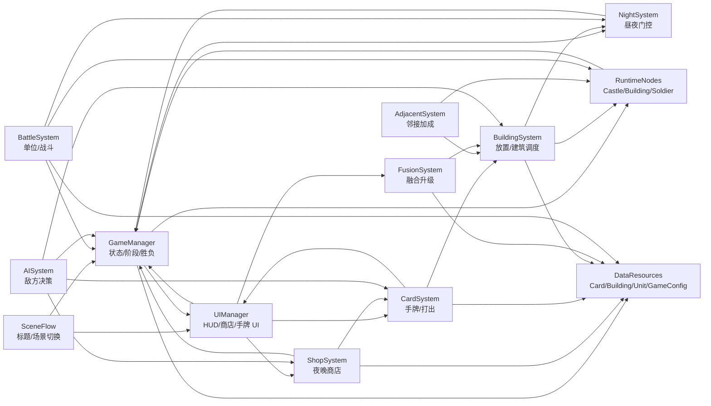

# 开发大纲 — CasualCastle（中文）

## 一、概述

这是一个简单的 2D RTS 游戏，类似皇室战争的玩法。

**核心玩法循环（完整版目标）：**

1. **白天阶段**：建筑产兵、部队战斗、放置建筑等一切正常进行
2. **夜晚阶段**：打开商店购买卡牌、花钱修复建筑；无「夜战」词条的建筑和士兵休眠，不再工作
3. **邻接加成**：建筑之间产生特殊的邻接加成效果
4. **融合升级**：夜晚可融合和升级建筑（类似背包乱斗）
5. **胜利条件**：摧毁对方城堡获得胜利

**昼夜机制：**

- 游戏仅在**白天**与**夜晚**两个阶段间循环，无独立的建造阶段或战斗阶段
- 白天：产兵、移动、攻击等行为与当前 M0 一致
- 夜晚：经济管理（购卡、修建筑）；普通单位休眠；带「夜战」词条的单位与建筑继续行动

---

## 二、当前进度总览

| 阶段 | 目标 | 状态 |
|------|------|------|
| M0 极简 MVP | 产兵 → 战斗 → 攻城堡 → 胜负 | ✅ 已完成（2026-06-15） |
| M0+ 体验增强 | 标题界面、BGM、结算返回标题 | ✅ 已完成 |
| M1 游戏流程框架 | 白天/夜晚状态机、休眠门控 | 🔜 **下一步** |
| M2 商店与手牌 | 夜晚购卡、修建筑、手牌打出 | 待开发 |
| M3 建筑与邻接 | 玩家放置、多建筑、邻接加成 | 待开发 |
| M4 夜战单位 | 夜战词条、特殊单位（狼人/刺客等） | 待开发 |
| M5 融合系统 | 建筑融合升级 | 待开发 |
| M6 完整版 MVP | AI 对手 + 全循环可玩 | 待开发 |

**当前可玩内容：** 标题页 → 自动产兵对战 Demo → 结算返回标题。完整版卡牌 RTS 循环尚未实现。

---

## 三、已完成内容

### 3.1 极简 MVP（M0，2026-06-15）

最小可玩循环：**兵营产兵 → 士兵前进/战斗 → 攻城堡 → 胜负判定**。

| 目标 | 状态 |
|------|------|
| 双方各有一座兵营 | ✅ |
| 兵营自动产出士兵 | ✅ |
| 单位自动移动并战斗 | ✅ |
| 城堡血量与胜负判定 | ✅ |
| 完整游戏循环人工验证 | ✅ |

| 模块 | 交付内容 | 关键文件 |
|------|----------|----------|
| 基础框架 | 主场景 1280×720、`GameManager` / `UIManager` | `scenes/main/main_game.tscn`, `scripts/autoload/` |
| 兵营与单位 | 兵营计时产兵、士兵属性与预制体 | `prefabs/Barracks.tscn`, `prefabs/Soldier.tscn`, `scripts/nodes/Barracks.cs`, `scripts/nodes/Soldier.cs` |
| 战斗系统 | 移动、互殴、攻建筑、死亡 | `scripts/nodes/Soldier.cs` |
| 城堡与胜负 | 城堡预制体、扣血、结算 | `prefabs/Castle.tscn`, `scripts/nodes/Castle.cs` |
| 场景配置 | 格子放置兵营、碰撞层、战场布局 | `scripts/nodes/Building.cs`, `scripts/nodes/Castle.cs` |

**场景约定：** 玩家兵营 (7,4)、敌方 (0,4)；建筑碰撞 56×56；产兵于相邻格左下角。

概念与实现细节见 `dev_plan/concepts.md`。

### 3.2 体验增强（M0+，M0 之后追加）

| 模块 | 交付内容 | 关键文件 |
|------|----------|----------|
| 标题界面 | 开始游戏 / 退出，场景切换 | `scenes/ui/title_screen.tscn`, `scripts/ui/TitleScreen.cs` |
| 基础 UI | 双方血条、结算遮罩、「返回标题」 | `scripts/autoload/UIManager.cs`, `main_game.tscn` UI 节点 |
| BGM | 标题与主游戏循环播放 | `scripts/nodes/BgmPlayer.cs`, `assets/audio/bgm/` |
| 开发工具 | 按键日志、作弊产兵（P 键） | `scripts/utils/DevInputLogger.cs`, `GameManager.cs` |

**入口流程：** `project.godot` → `title_screen.tscn` → `main_game.tscn`。

### 3.3 已具备、可复用的基础 API

以下代码为完整版开发提供了基础，但尚未接入玩家交互：

| API / 能力 | 位置 | 说明 |
|------------|------|------|
| 城堡格子与放置 | `Castle.PlaceBuilding`, `GetBuildingSpawnPosition` | 目前仅 `SetupBarracks()` 自动放置 |
| 格子通行检测 | `Castle.IsCellPassable` | 士兵未使用寻路，API 已预留 |
| 建筑基类 | `Building.cs` | 碰撞层、阵营；无独立 HP |
| 卡牌边框素材 | `assets/art/cards/card_border.png` | 已导入，代码未引用 |

---

## 四、完整版功能清单

| 模块 | 功能 | 状态 | 备注 |
|------|------|------|------|
| 游戏流程 | 白天/夜晚交替、阶段切换 | ❌ 待开发 | `GameManager` 仅有 Playing / GameOver |
| 夜晚经济 | 商店购卡、花钱修复建筑 | ❌ 待开发 | 夜晚专属交互 |
| 夜晚休眠 | 无夜战词条的单位/建筑停止工作 | ❌ 待开发 | M1 门控骨架，M4 夜战例外 |
| 商店系统 | 购买建筑卡牌 | ❌ 待开发 | 无 `ShopSystem` |
| 手牌系统 | 卡牌管理、打出 | ❌ 待开发 | 无 `CardSystem` |
| 建筑系统 | 玩家放置、多类型、产出 | 🟡 部分 | 仅 `Barracks` 自动放置 |
| 战斗系统 | 部队 AI、攻击、死亡 | 🟡 部分 | 极简互殴已实现 |
| 邻接系统 | 建筑邻接加成 | ❌ 待开发 | |
| 融合系统 | 建筑融合升级 | ❌ 待开发 | |
| UI 界面 | 商店、手牌、金币、融合 | 🟡 部分 | 标题/血条/结算已有 |
| AI 对手 | 购卡/放置/决策 | ❌ 待开发 | 敌方仅为对称自动兵营 |
| 数据层 | CardData / BuildingData 资源 | ❌ 待开发 | 见 `data_structures.md` 草案 |
| 存档 | 保存/读取 | ❌ 待开发 | 不在 MVP 范围 |

---

## 五、项目架构

### 5.1 实际目录结构（当前）

```
CasualCastle/
├── scripts/
│   ├── autoload/              # 场景内单例（未注册 Godot Autoload）
│   │   ├── GameManager.cs
│   │   └── UIManager.cs
│   ├── nodes/
│   │   ├── Building.cs        # 建筑基类
│   │   ├── Barracks.cs
│   │   ├── Soldier.cs
│   │   ├── Castle.cs
│   │   └── BgmPlayer.cs
│   ├── ui/
│   │   └── TitleScreen.cs
│   └── utils/
│       └── DevInputLogger.cs
├── scenes/
│   ├── main/main_game.tscn
│   └── ui/title_screen.tscn
├── prefabs/
│   ├── Castle.tscn
│   ├── Barracks.tscn
│   └── Soldier.tscn
├── assets/                    # 占位图、士兵图、BGM、卡牌边框
├── dev_plan/                  # 开发文档
└── resources/                 # 空，待放 .tres 数据资源
```

### 5.2 规划目录结构（完整版目标）

```
scripts/
├── autoload/
│   ├── GameManager.cs         # 扩展：阶段状态机
│   ├── CardSystem.cs          # 待建
│   └── UIManager.cs           # 扩展：商店/手牌 UI
├── systems/
│   ├── ShopSystem.cs          # 待建
│   ├── BuildingSystem.cs      # 待建
│   ├── AdjacentSystem.cs      # 待建
│   ├── FusionSystem.cs        # 待建
│   ├── BattleSystem.cs        # 待建（从 Soldier 逻辑抽离）
│   └── NightSystem.cs         # 待建（夜晚休眠与夜战判定）
├── utils/
│   ├── GameConfig.cs          # 待建
│   └── Pathfinding.cs         # 待建
└── nodes/                     # 已有，持续扩展
resources/
├── cards/                     # CardData .tres
├── buildings/                 # BuildingData .tres
└── units/                     # UnitData .tres
```

### 5.3 核心系统说明

| 系统 | 职责 | 当前状态 |
|------|------|----------|
| GameManager | 游戏状态、阶段切换、胜负 | 仅 Playing / GameOver |
| UIManager | HUD、结算、场景跳转 | 血条 + 结算 |
| CardSystem | 手牌管理、打出逻辑 | 未建 |
| ShopSystem | 商店刷新、购买、金币 | 未建 |
| BuildingSystem | 放置验证、属性、产出 | 逻辑散落在 Castle / Barracks |
| BattleSystem | 部队生成、战斗 AI | 逻辑在 Soldier.cs |
| AdjacentSystem | 邻接检测与加成 | 未建 |
| FusionSystem | 融合条件与升级 | 未建 |
| NightSystem | 夜晚休眠门控、夜战词条判定 | 未建 |

### 5.4 系统模块设计

系统模块按“流程控制 → 玩家操作 → 场上执行 → 数据配置”的方向组织。`GameManager` 只负责全局状态、阶段和胜负；具体玩法逻辑尽量放到对应系统中，避免继续堆到单个节点脚本里。

| 模块 | 职责 | 主要依赖 |
|------|------|----------|
| SceneFlow | 标题页、进入主游戏、返回标题 | `TitleScreen`, `GameManager` |
| GameManager | 游戏状态、昼夜阶段、胜负、全局信号 | `GameConfig`, `Castle`, `UIManager` |
| UIManager | HUD、结算、阶段显示、商店/手牌入口 | `GameManager`, `ShopSystem`, `CardSystem` |
| NightSystem | 昼夜行动门控、夜战词条判定 | `GameManager`, `BuildingSystem`, `BattleSystem` |
| ShopSystem | 夜晚商店、刷新、购买、金币消费 | `GameManager`, `CardSystem`, `CardData` |
| CardSystem | 手牌、卡牌打出、卡牌到建筑的转换 | `CardData`, `BuildingSystem`, `UIManager` |
| BuildingSystem | 建筑放置、占格验证、建筑工作调度 | `Castle`, `BuildingData`, `NightSystem` |
| AdjacentSystem | 建筑邻接检测、加成刷新 | `BuildingSystem`, `Castle` |
| FusionSystem | 建筑融合条件、升级结果生成 | `BuildingSystem`, `BuildingData`, `UIManager` |
| BattleSystem | 士兵生成、行动、索敌、攻击与死亡 | `UnitData`, `NightSystem`, `Castle` |
| AISystem | 敌方购卡、放置、战术决策 | `GameManager`, `ShopSystem`, `CardSystem`, `BuildingSystem` |
| DataResources | 卡牌、建筑、单位、全局配置数据 | `CardData`, `BuildingData`, `UnitData`, `GameConfig` |

模块依赖关系如下：



---

## 六、修订后的开发顺序

> 以下顺序基于 M0 已完成的前提重新编排。已跳过的任务（项目初始化、基础场景、极简战斗）不再重复列出。

### 6.1 第一阶段：游戏流程框架（M1，约 1 周）— 🔜 下一步

**目标：** 从「一直产兵对战」升级为「白天 / 夜晚」两阶段循环骨架。

| 任务 | 描述 | 预估 |
|------|------|------|
| 阶段状态机 | 在 `GameManager` 增加 `Day` / `Night` 及 `AdvancePhase()` | 1.5 天 |
| 阶段 UI | 顶部阶段指示器、开发用「切换昼夜」按钮 | 0.5 天 |
| 夜晚休眠门控 | 夜晚暂停无夜战词条的兵营产兵与士兵行动 | 1 天 |
| 夜战词条占位 | `Building` / `Soldier` 增加 `HasNightCombat` 属性（默认 false） | 0.5 天 |
| 数据资源骨架 | 创建 `GameConfig`、首批 `BuildingData` .tres | 1 天 |
| 目录搭建 | 建立 `scripts/systems/`、`resources/` 子目录 | 0.5 天 |

**交付物：**

- 可手动切换 Day ↔ Night 的 Demo
- 白天行为与当前 M0 一致
- 夜晚双方兵营与士兵休眠（尚无夜战单位）
- 数据结构文件就位，供 M2 使用

### 6.2 第二阶段：夜晚经济与手牌（M2，约 1 周）

| 任务 | 描述 | 预估 |
|------|------|------|
| ShopSystem | 夜晚打开商店、刷新、购买、金币管理 | 2 天 |
| 建筑修复 | 夜晚花钱修复受损建筑 | 1 天 |
| CardSystem | 手牌添加/移除/打出 | 2 天 |
| 卡牌 UI | 手牌区显示、点击打出到城堡格子 | 2 天 |

**交付物：**

- 夜晚可打开商店购卡
- 夜晚可修复建筑
- 白天可将手牌打出到城堡格子

### 6.3 第三阶段：建筑与邻接（M3，约 1–2 周）

| 任务 | 描述 | 预估 |
|------|------|------|
| BuildingSystem | 从 Castle 抽离放置验证与产出调度 | 2 天 |
| 多建筑类型 | 至少 3 种（兵营 + 2 种新建筑），复用 `Building` 基类 | 3 天 |
| AdjacentSystem | 四方向邻接检测、加成应用与刷新 | 2 天 |
| 建筑 UI | 格子高亮、放置预览、非法位置提示 | 1 天 |

**交付物：**

- 玩家可放置多种建筑
- 邻接加成实时生效

### 6.4 第四阶段：夜战单位（M4，约 1 周）

| 任务 | 描述 | 预估 |
|------|------|------|
| 夜战词条 | `HasNightCombat` 接入数据资源，夜晚豁免休眠 | 1 天 |
| 特殊单位 | 狼人/刺客等夜战单位（至少 1 种） | 2 天 |
| BattleSystem | 从 `Soldier.cs` 抽离战斗调度（可选） | 2 天 |
| 寻路（可选） | `Pathfinding` 接入 `IsCellPassable` | 2 天 |

**交付物：**

- 夜战单位在夜晚仍可产兵/战斗
- 普通单位夜晚继续休眠

### 6.5 第五阶段：融合系统（M5，约 1 周）

| 任务 | 描述 | 预估 |
|------|------|------|
| FusionSystem | 融合条件检测、升级生成 | 3 天 |
| 融合 UI | 夜晚融合选择界面 | 2 天 |

**交付物：**

- 夜晚可融合升级建筑

### 6.6 第六阶段：AI 与打磨（M6，约 1 周）

| 任务 | 描述 | 预估 |
|------|------|------|
| AI 对手 | 购卡、放置、简单优先级决策 | 3 天 |
| 结算优化 | 局内重开 vs 返回标题统一 | 0.5 天 |
| 性能与 Bug | 测试修复 | 2 天 |

**交付物：**

- 完整版 MVP 可单人对战 AI

---

## 七、下一步开发内容（立即行动）

**当前焦点：M1 白天 / 夜晚流程框架。** 阶段规则见 `concepts.md` §昼夜阶段。

建议按以下顺序推进，每完成一项即可人工验证：

1. **扩展 `GameManager` 阶段枚举**
   - 新增 `GamePhase`：`Day`、`Night`（保留 `GameOver`）
   - 提供 `AdvancePhase()`（Day ↔ Night 切换）与 `PhaseChanged` 信号
   - 初始阶段为 `Day`

2. **夜晚休眠门控**
   - `Barracks`：夜晚且 `HasNightCombat == false` 时停止 `SpawnTimer`
   - `Soldier`：夜晚且 `HasNightCombat == false` 时停止移动与攻击（原地休眠）
   - `Building` / `Soldier` 增加 `HasNightCombat` 属性，M1 默认均为 `false`

3. **阶段 UI 最小实现**
   - 主游戏顶部显示「白天」/「夜晚」
   - 开发用按钮「切换昼夜」手动推进（后续再换自动计时）

4. **建立数据层目录**
   - `resources/buildings/barracks.tres`（含产兵间隔、`HasNightCombat` 等）
   - `scripts/utils/GameConfig.cs`（阶段时长、初始金币等常量）

5. **创建 `scripts/systems/` 空壳**
   - `NightSystem.cs`：集中处理阶段切换时的休眠/唤醒
   - `ShopSystem.cs`、`CardSystem.cs` 仅占位类，M2 再填充

**完成 M1 的验收标准：**

- 从标题进入游戏后，可看到当前阶段（白天/夜晚）
- 点击「切换昼夜」能在 Day ↔ Night 间切换
- 白天：双方兵营产兵、士兵战斗，与 M0 一致
- 夜晚：双方兵营停止产兵、士兵停止行动（原地休眠）
- 胜负判定与返回标题流程不受影响

**M2 在此基础上追加（本阶段不做）：**

- 夜晚打开商店购买卡牌
- 夜晚花钱修复建筑

---

## 八、数据结构设计

卡牌、建筑、部队等核心数据结构见 `dev_plan/data_structures.md`。

M1 建议先落地：

- `GameConfig`：白天/夜晚时长、初始金币、商店槽位数
- `BuildingData`：名称、花费、产出间隔、产出单位预制体、`HasNightCombat`
- `CardData`：关联 `BuildingData`、卡牌图标
- `UnitData`：`HasNightCombat`（士兵夜战词条）

---

## 九、里程碑

| 里程碑 | 目标 | 状态 |
|--------|------|------|
| M0 | 极简 MVP：产兵对战与胜负循环 | ✅ 2026-06-15 |
| M0+ | 标题界面、BGM、结算流程 | ✅ |
| M1 | 白天/夜晚状态机，夜晚休眠门控 | 🔜 下一步 |
| M2 | 夜晚商店、修建筑、手牌系统 | 待开发 |
| M3 | 建筑放置与邻接加成 | 待开发 |
| M4 | 夜战词条与特殊单位 | 待开发 |
| M5 | 融合系统 | 待开发 |
| M6 | 完整版 MVP（含 AI） | 待开发 |

---

## 十、技术栈

| 分类 | 技术 |
|------|------|
| 引擎 | Godot 4.6 (C#) |
| 渲染 | Forward+ |
| 物理 | Jolt Physics |
| 语言 | C# / .NET |
